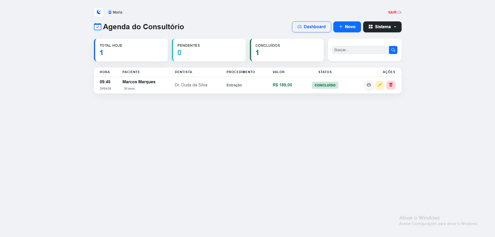
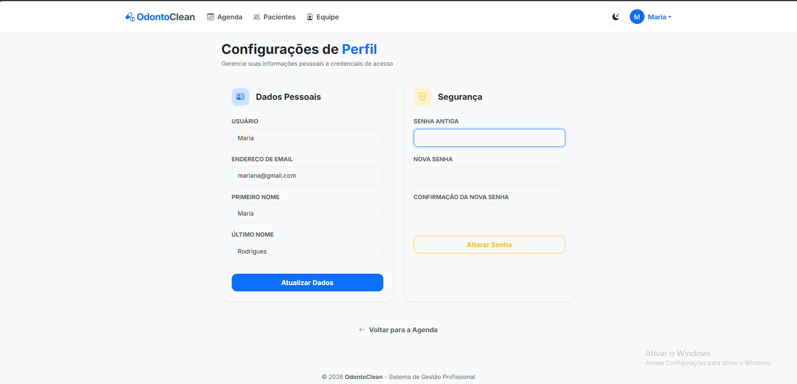
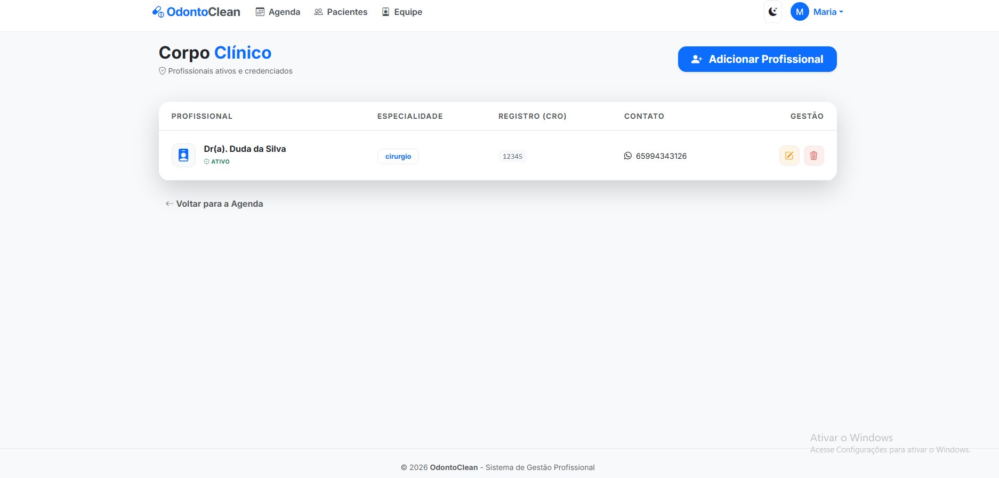
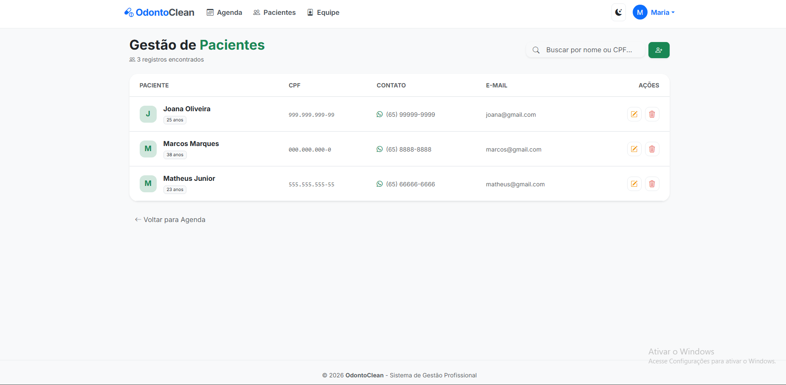
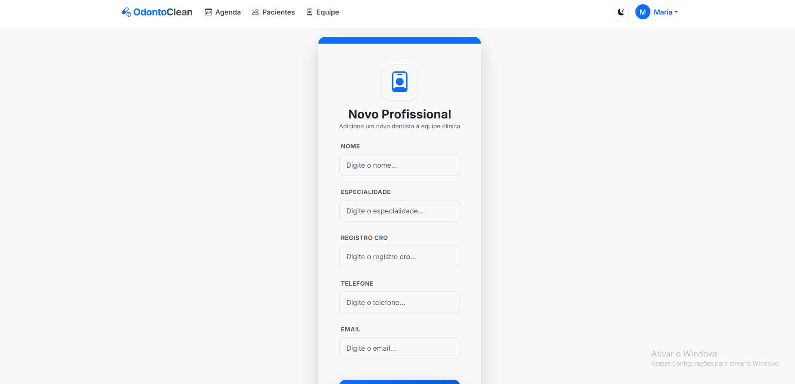
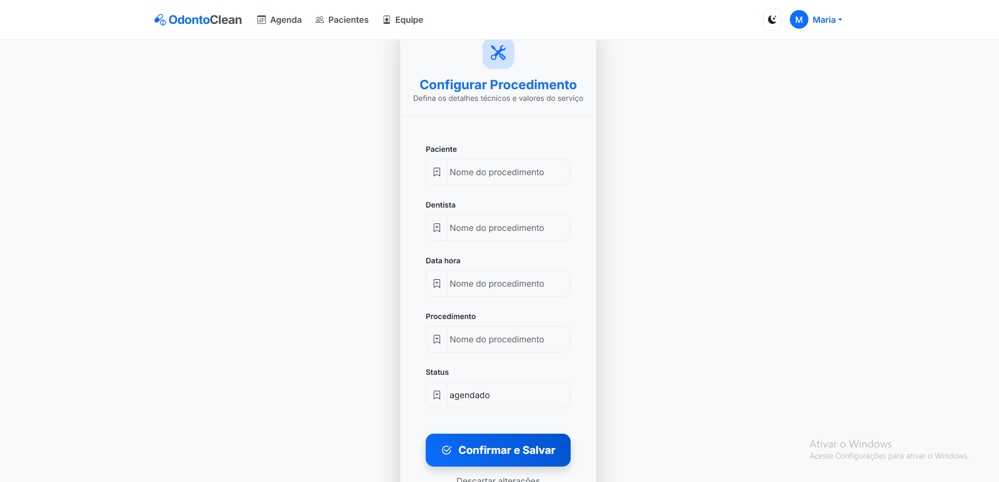
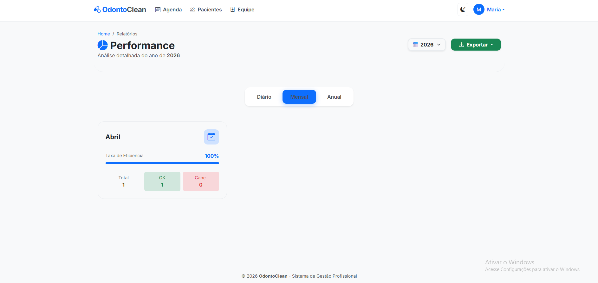
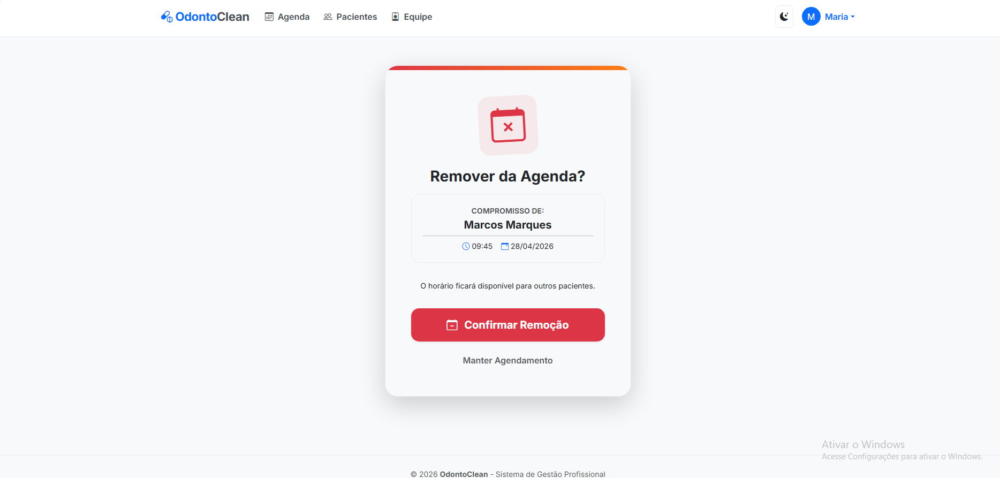

# 🦷 OdontoClean - Sistema de Agendamento Odontológico

O **OdontoClean** é uma aplicação web completa desenvolvida em Django para gestão de consultórios dentários. O sistema permite o controle de pacientes, dentistas, procedimentos e uma agenda dinâmica com suporte a temas (Light/Dark Mode).

## 🚀 Funcionalidades

- **Dashboard Estatístico:** Visualização rápida de agendamentos pendentes, concluídos e totais do dia.
- **Gestão de Agenda (CRUD):** Criar, editar, visualizar e excluir agendamentos com facilidade.
- **Filtro de Busca:** Localização rápida de pacientes na agenda.
- **Relatórios:** Geração de agenda do dia em formato PDF.
- **Interface Moderna:** Design responsivo feito com Bootstrap 5 e suporte a **Dark Mode**.
- **Segurança:** Variáveis de ambiente protegidas e controle de acesso para usuários autenticados.

## 🛠️ Tecnologias Utilizadas

- **Backend:** Python / Django 6.0
- **Frontend:** Bootstrap 5 / Bootstrap Icons / Animate.css
- **Banco de Dados:** SQLite (Desenvolvimento)
- **Segurança:** Python-Dotenv
- **Relatórios:** ReportLab (ou biblioteca utilizada para o PDF)

## 📦 Como Instalar e Rodar o Projeto

1. Clonar o Repositório
```bash
git clone [https://github.com/seu-usuario/seu-repositorio.git](https://github.com/seu-usuario/seu-repositorio.git)
cd seu-repositorio

2. Criar e ativar o ambiente virtual

python -m venv venv

# Windows:
venv\Scripts\activate

# Linux/Mac:
source venv/bin/activate

3. Instalar as Dependências

pip install -r requirements.txt

4. Configurar as Variáveis ​​de Ambiente

Crie um arquivo .envna raiz do projeto seguindo o modelo abaixo:

SECRET_KEY=sua_chave_secreta
DEBUG=True
ALLOWED_HOSTS=localhost,127.0.0.1

5. Executar Migrações e Iniciar o Servidor

python manage.py migrate
python manage.py runserver

🎨 Interface


















📄 Licença
Este projeto está sob licença MIT. Veja o arquivoLICENÇApara mais detalhes.

Desenvolvido por Matheus Juninior - [https://www.linkedin.com/in/matheus-junior-z/]

